<br>


## 👧 Project. 삐삐 (BIBI .Best interior)
> ### Main Project.
> **인테리어 추천 커뮤니티**
> <br>

>> **개발기간 : 2023.8.24 ~ 2023.9.22**
>> - **[Figma Link](https://www.figma.com/proto/3MSu8itfdIAVpbBeKsLjdY/%EC%82%90%EC%82%90?page-id=0%3A1&type=design&node-id=57-387&viewport=-184%2C404%2C0.1&t=Jv43UfBRWQAq4IqW-1&scaling=min-zoom&starting-point-node-id=52%3A626&mode=design)**
>> - **[배포사이트](https://bbibbiapp.click/)**

<br>

## 목차
- [프로젝트팀 소개](#-프로젝트팀-소개)
- [Stack](#%EF%B8%8F-stack)
- [서론](#-서론)
  - [서비스 개요](#-서비스-개요)
  - [메뉴얼 목적 & 대상 사용자](#-메뉴얼-목적--대상-사용자)
- [기본 가이드](#-기본-가이드)
  - [화면 구성](#-화면-구성)
  - [기능 설명](#-기능-설명)
- [Documents](#-documents)
- [디렉토리구조](#-디렉토리구조)


<br>

## 🧑‍💻 프로젝트팀 소개
|<center>윤 예빈</center>|<center>최 유리</center>|<center>이 원호</center>|<center>신 선호</center>|<center>박 두산</center>|<center>임 한준</center>|<center>안 형섭</center>|
|---|---|---|---|---|---|---|
||||||||
|<center>`FE_팀장`</center>|<center>`FE_팀원`</center>|<center>`FE_팀원`</center>|<center>`BE_부팀장`</center>|<center>`BE_팀원`</center>|<center>`BE_팀원`</center>|<center>`BE_팀원`</center>|
|[@YebinYun](https://github.com/YebinYun)|[@greatjobcat](https://github.com/greatjobcat)|[@WONHO22](https://github.com/WONHO22)|[@seonhoshin](https://github.com/seonhoshin)|[@2DNDN](https://github.com/2DNDN)|[@Ernest45](https://github.com/Ernest45)|[@PeterAhnn](https://github.com/PeterAhnn)|

<br>


## ⚒️ Stack
### **Front-End**

      

### **Back-End**
        

<br>

## 📚 서론

### 📗 서비스 개요

- 인테리어 추천 커뮤니티 웹사이트는 인테리어에 관심있는 사용자들을 위한 다기능 온라인 플랫폼입니다.
커뮤니티 기반의 정보 공유와 함께, 해시태그 기능을 통해 특정 주제나 제품에 대한 정보를 쉽게 검색하고 모아볼 수 있습니다.
추가적으로 GPS를 활용한 지역 기반 인테리어 가게 추천, 북마크와 기능, 그리고 팔로우와 팔로워 기능을 제공하여 사용자 간의 소통과 정보 공유를 촉진합니다.


### 📕 메뉴얼 목적 & 대상 사용자
- 본 서비스는 사용자들의 편리한 사용을 위해 이 메뉴얼을 작성하였습니다.
인테리어에 관심이 많고 커뮤니케이션을 중요시하는 사용자를 주요 대상으로 하고 있습니다.
블로그나 카페와 같이 정보 공유와 소통이 활발한 온라인 공간을 찾고 있는 사용자에게 이 웹사이트는 다음과 같은 기능과 가치를 제공합니다.

  ```
  1. 해시태그 기능을 통한 특정 주제나  제품에 대한 빠른 정보 검색과 공유

  2. 맞춤화 된 인테리어 추천과 라이프 스타일 공유 기능

  3. 지역 기반 인테리어 스토어 추천을 통한 현실적인 이용 가능성

  4. 팔로우와 팔로워 기능을 통한 커뮤니케이션 강화

  5. 좋아요와 북마크 기능을 통해 마음에 드는 내용을 쉽게 저장하고 검색
  ```

- 이러한 기능들을 통해 사용자는 자신의 취향과 필요에 맞는 인테리어 정보를 쉽게 찾고, 같은 관심사를 가진 다른 사용자들과 소통할 수 있습니다.

<br>

## 🔎 기본 가이드
### 🎥 화면 구성
|기능별|화면|
|---|---|
|**`메인 페이지`**|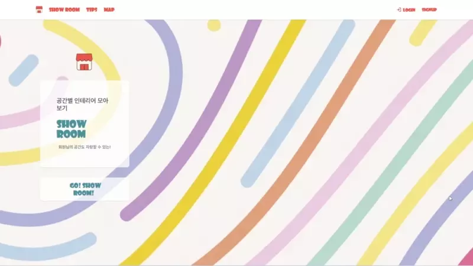|
|**`회원가입`**|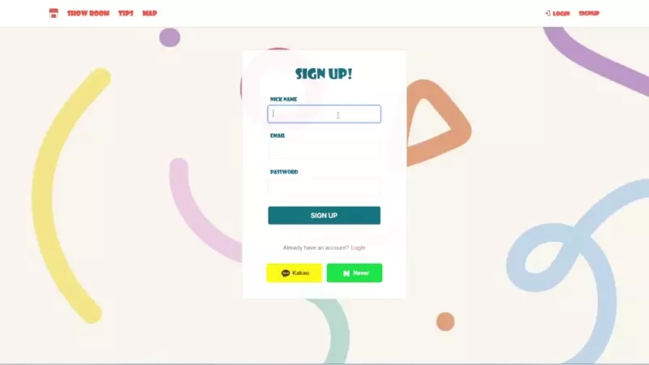|
|**`로그인`**|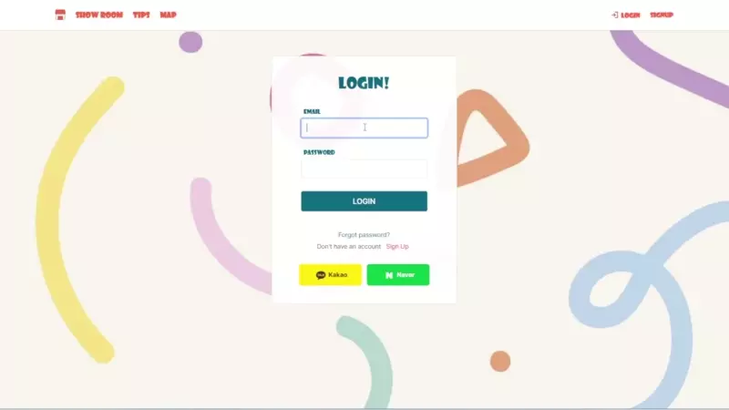|
|**`베스트 인테리어`**|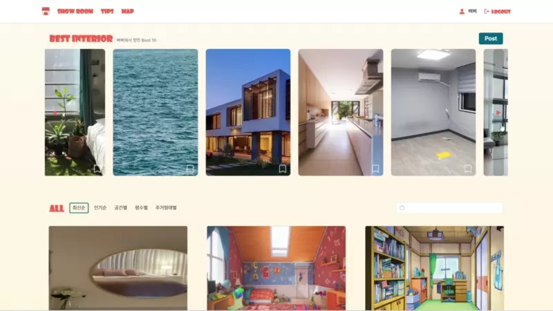|
|**`인테리어 작성창`**|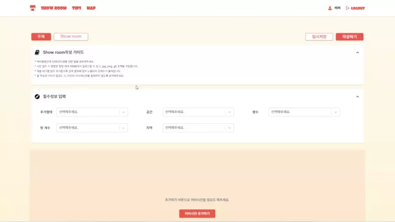|
|**`인테리어 상세보기`**|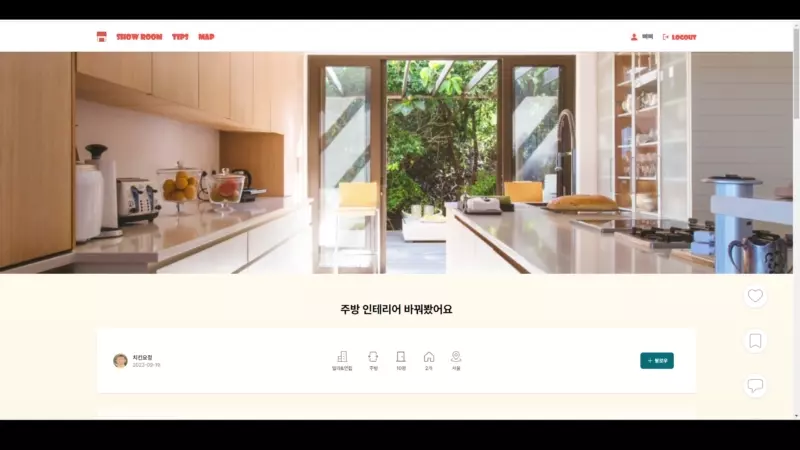|
|**`팁`**|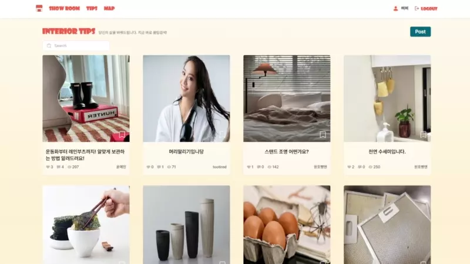|
|**`팁 작성창`**|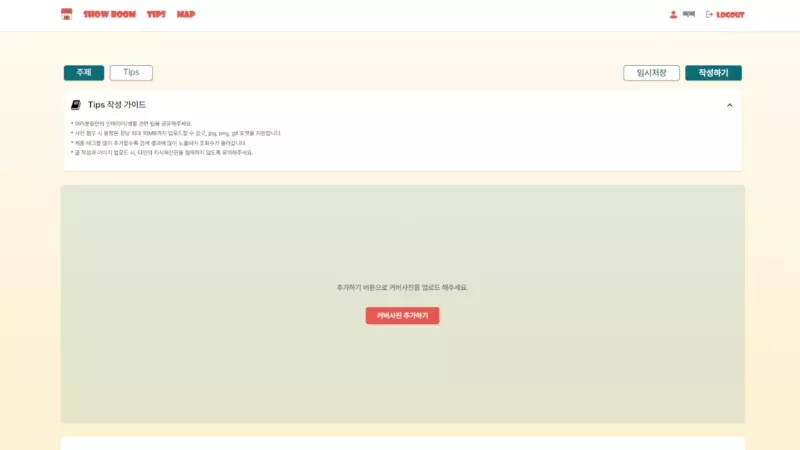|
|**`팁 상세보기`**|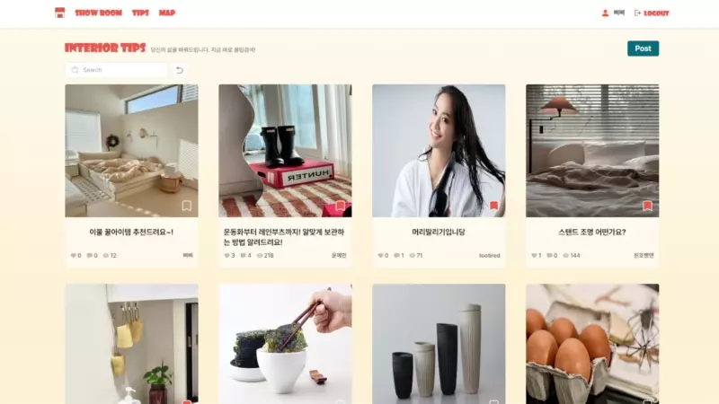|
|**`맵`**|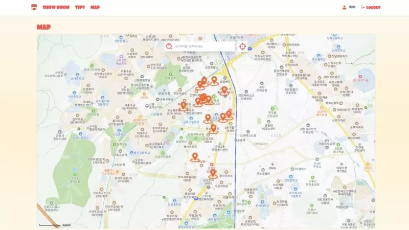|
|**`나의 프로필`**|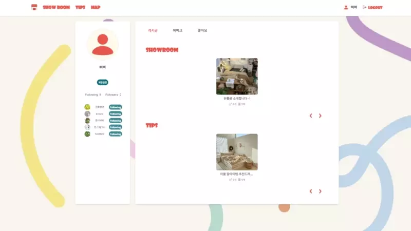|
|**`다른사람 프로필`**|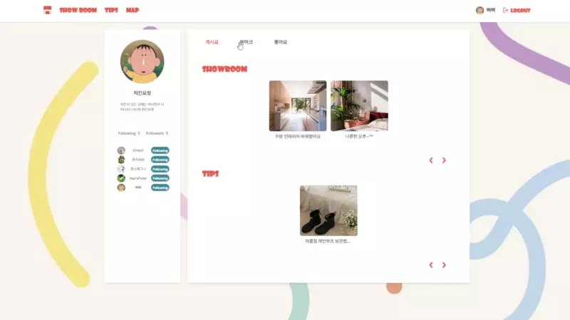|

<br>

### 💡 기능 설명


#### 인테리어 추천 커뮤니티
- `전체글 조회`
  - 인테리어 게시글은 무한스크롤을 적용해, 실시간으로 정보를 받아 볼 수 있습니다.


- `검색어로 검색`
  - 검색어가 제목, 본문이 포함되어있다면 조회 가능합니다.


- `필터별 조회`
  - 필터별로 조회할 수 있습니다.


- `이미지 태그`
  - 게시글 작성시 작성자가 이미지에 태그를 붙여 저 직관적으로 정보를 공유 할 수 있습니다.


#### 꿀팁 정보 공유 커뮤니티
- `해시태그 등록`
  - 작성한 글의 주제와 관련된 해시태그를 등록할 수 있습니다.


- `해시태그 클릭/검색`
  - 해시 태그 클릭시 해당 태그가 포함된 글을 모아볼 수 있습니다.


#### 주변 인테리어 가게 검색
- `GPS`
  - 현재 위치 기반 정보를 이용 주변 인테리어 스토어 검색 기능


- `검색기능`
  - 원하는 가게에 이름을 검색하면 조회하는 기능


#### 회원정보 기능
- `회원가입 기능`
  - 커뮤니티 관련 기능을 추가적으로 이용하기 위해 회원가입을 제공해 회원의 데이터들을 바탕으로 각 회원이 원하는 정보들만 모아 편리하게 사용 가능하게 해줍니다.


- `로그인 기능`
  - 로그인 회원만  커뮤니티 활동 가능


- `내 정보 관리`
  - 프로필 개성에 맞게 꾸며 게시글만이 아니라 내 소개글이나 자신의 이미지를 등을 활용해 자신만의 특색을 드러낼 수 있습니다.


- `회원탈퇴기능`
  - 본 서비스를 더 이상 사용하고 싶지 않거나, 자신의 정보들을 더 이상 제공하고 싶지 않을 경우에는 보다 쉽게 회원탈퇴의 기능을 지원

- `비밀번호 관리`
  - 비밀번호 초기화 
  - 비밀번호변경 


#### 커뮤니케이션 공통 기능
- `좋아요 / 북마크`
  - **좋아요** <br>
  다른 사용자가 작성한 게시글이나 댓글에 긍정적인 피드백을 주는 기능입니다. 이 기능을 사용하면 작성자는 작성자의 게시글이나 댓글 공감과 반응을 파악할 수 있습니다.


  - **북마크** <br>
  특정한 게시글들을 나중에 닷 찾아보기 쉽게 저장하는 기능합니다. 
  
  - 해당 **좋아요 / 북마크** 기능은 마이 페이지에서 모아 볼 수 있습니다.


- `팔로우 / 팔로워`
  - 마음에 드는 사용자들을 팔로우/언팔로우 할 수 있이며, 마이페이지에서 모아서 볼 수 있습니다.


- `댓글 / 답글`
  - 게시글에 공감하거나 정보를 얻었다면 댓글과 답글을 통해 작성자 및 다른 이용자들과 자유롭게 소통할 수 있습니다.


#### 반응형 사이트
- `모바일`, `테블릿`, `피씨` 모두 볼 수 있도록 맞춤 화면 구현하였습니다.


<br>

## 📝 Documents

<details>
<summary> 사용자 요구사항 정의서</summary>
<ul>
  <li>
    <a href="https://docs.google.com/spreadsheets/d/1Cq4gmcb3omQu3MQUWMOc1XeIsJIoR1QVwar9BUNeyKY/edit?usp=sharing"> 사용자 요구사항 정의서 보러가기 </a>
</ul>
</details>

<br>

<details>
<summary> User Flow </summary>
<ul>
  <li>
    <a href="https://www.figma.com/file/ccPMHNAJGxBvzXw5efDpHd/%5B%EC%82%90%EC%82%90%5D-User-Flow?type=whiteboard&node-id=0%3A1&t=TDKMpEfcYube2vXF-1"> User Flow 보러가기 </a>
</ul>
</details>

<br>

<details>
<summary> 테이블 설계도 </summary>
<ul>
  <li>
    <a href="https://docs.google.com/spreadsheets/d/13aEWm6ivfhtiLjdQsT6h7vzbVAprHeEO2y9OVaC-GpQ/edit?usp=sharing"> 테이블 설계도 보러가기 </a>
</ul>
</details>

<br>

## 📝 디렉토리구조

```
seb45_main_027
├─ README.md
├─ client
│  ├─ .env
│  ├─ src
│  │  ├─ App.css
│  │  ├─ App.js
│  │  ├─ components
│  │  │  ├─ accountSetting
│  │  │  │  ├─ ChangePassword.jsx
│  │  │  │  ├─ DeleteAccount.jsx
│  │  │  │  ├─ EditProfile.jsx
│  │  │  │  └─ UserAccount.jsx
│  │  │  ├─ common
│  │  │  │  ├─ Background.jsx
│  │  │  │  ├─ Ex_button.jsx
│  │  │  │  ├─ scrollToTop.js
│  │  │  │  └─ tokens.js
│  │  │  ├─ feed
│  │  │  │  ├─ comment
│  │  │  │  │  ├─ showroom
│  │  │  │  │  │  ├─ CommentDelete.jsx
│  │  │  │  │  │  ├─ CommentInput.jsx
│  │  │  │  │  │  ├─ CommentLike.jsx
│  │  │  │  │  │  ├─ CommentOutput.jsx
│  │  │  │  │  │  ├─ CommentPagination.jsx
│  │  │  │  │  │  ├─ CommentPatch.jsx
│  │  │  │  │  │  ├─ CommentWrap.jsx
│  │  │  │  │  │  ├─ ReplyDelete.jsx
│  │  │  │  │  │  ├─ ReplyInput.jsx
│  │  │  │  │  │  ├─ ReplyOutput.jsx
│  │  │  │  │  │  └─ ReplyPatch.jsx
│  │  │  │  │  └─ tips
│  │  │  │  │     ├─ CommentDeleteTips.jsx
│  │  │  │  │     ├─ CommentInputTips.jsx
│  │  │  │  │     ├─ CommentLikeTips.jsx
│  │  │  │  │     ├─ CommentOutputTips.jsx
│  │  │  │  │     ├─ CommentPaginationTips.jsx
│  │  │  │  │     ├─ CommentPatchTips.jsx
│  │  │  │  │     ├─ CommentWrapTips.jsx
│  │  │  │  │     ├─ ReplyDeleteTips.jsx
│  │  │  │  │     ├─ ReplyInputTips.jsx
│  │  │  │  │     ├─ ReplyOutputTips.jsx
│  │  │  │  │     └─ ReplyPatchTips.jsx
│  │  │  │  ├─ view
│  │  │  │  │  ├─ Edit.jsx
│  │  │  │  │  ├─ ShowroomContents.jsx
│  │  │  │  │  ├─ ShowroomUserTop.jsx
│  │  │  │  │  ├─ Sidebar.jsx
│  │  │  │  │  ├─ TagForm.jsx
│  │  │  │  │  ├─ TipsContents.jsx
│  │  │  │  │  ├─ TipsUserTop.jsx
│  │  │  │  │  ├─ UserBottom.jsx
│  │  │  │  │  ├─ ViewCoverImg.jsx
│  │  │  │  │  ├─ ViewForm.jsx
│  │  │  │  │  ├─ ViewPoint.jsx
│  │  │  │  │  └─ ViewTitle.jsx
│  │  │  │  └─ write
│  │  │  │     ├─ ImageEditGuide.jsx
│  │  │  │     ├─ PhotoTagging.jsx
│  │  │  │     ├─ Tag.jsx
│  │  │  │     ├─ WriteBtn.jsx
│  │  │  │     ├─ WriteCoverImg.jsx
│  │  │  │     ├─ WriteFormShowroom.jsx
│  │  │  │     ├─ WriteFormTips.jsx
│  │  │  │     ├─ WriteGuide.jsx
│  │  │  │     ├─ WriteInformation.jsx
│  │  │  │     ├─ WriteTag.jsx
│  │  │  │     └─ WriteTitle.jsx
│  │  │  ├─ footer
│  │  │  │  ├─ FooterMobile.jsx
│  │  │  │  ├─ FooterMobileWrite.jsx
│  │  │  │  ├─ FooterPc.jsx
│  │  │  │  └─ HiddenFooter.jsx
│  │  │  ├─ header
│  │  │  │  ├─ HeaderMobile.jsx
│  │  │  │  ├─ HeaderNav.jsx
│  │  │  │  ├─ HeaderOff.jsx
│  │  │  │  ├─ HeaderOn.jsx
│  │  │  │  └─ HeaderPc.jsx
│  │  │  ├─ main
│  │  │  │  ├─ MainSection.jsx
│  │  │  │  ├─ MainSlogan.jsx
│  │  │  │  └─ MainWrap.jsx
│  │  │  ├─ map
│  │  │  │  ├─ KaKaoMap.css
│  │  │  │  ├─ KakaoMap.jsx
│  │  │  │  └─ SearchBar.jsx
│  │  │  ├─ myinfo
│  │  │  │  ├─ MyInfoBookmark.jsx
│  │  │  │  ├─ MyInfoContentList.jsx
│  │  │  │  ├─ MyInfoDummy.js
│  │  │  │  ├─ MyInfoLayout.jsx
│  │  │  │  ├─ MyInfoLike.jsx
│  │  │  │  ├─ MyInfoPost.jsx
│  │  │  │  ├─ MyInfoShowroom.jsx
│  │  │  │  ├─ Pagination.jsx
│  │  │  │  ├─ UserInfoFollow.jsx
│  │  │  │  ├─ UserInfoFollowList.jsx
│  │  │  │  ├─ UserProfile.jsx
│  │  │  │  └─ UserProfileDetails.jsx
│  │  │  ├─ showroom
│  │  │  │  ├─ all
│  │  │  │  │  ├─ All.jsx
│  │  │  │  │  ├─ AllContent.jsx
│  │  │  │  │  ├─ AllHeader.jsx
│  │  │  │  │  └─ HeaderFilter
│  │  │  │  │     ├─ AllHeaderFilter.jsx
│  │  │  │  │     ├─ RoomInfoFilter.jsx
│  │  │  │  │     ├─ RoomSizeFilter.jsx
│  │  │  │  │     └─ RoomTypeFilter.jsx
│  │  │  │  └─ bestinterior
│  │  │  │     ├─ BestInterior.jsx
│  │  │  │     ├─ BestInteriorCarousel.css
│  │  │  │     ├─ BestInteriorCarousel.jsx
│  │  │  │     └─ BestInteriorHeader.jsx
│  │  │  ├─ signup
│  │  │  │  ├─ AuthNavigation.jsx
│  │  │  │  ├─ FormLayout.jsx
│  │  │  │  ├─ FormValidation.jsx
│  │  │  │  ├─ OauthLayout.jsx
│  │  │  │  ├─ ResetPassword.jsx
│  │  │  │  ├─ SignupAuth.jsx
│  │  │  │  └─ SignupLoginLayout.jsx
│  │  │  └─ tips
│  │  │     ├─ TipsContent.jsx
│  │  │     ├─ TipsHeader.jsx
│  │  │     └─ TipsInfo.jsx
│  │  ├─ context
│  │  │  └─ AuthContext.jsx
│  │  ├─ index.css
│  │  ├─ index.js
│  │  └─ pages
│  │     ├─ EditShowRoom.jsx
│  │     ├─ EditTips.jsx
│  │     ├─ Login.jsx
│  │     ├─ Main.jsx
│  │     ├─ Map.jsx
│  │     ├─ MyInfo.jsx
│  │     ├─ ProtectedRoute.jsx
│  │     ├─ ShowRoom.jsx
│  │     ├─ Signup.jsx
│  │     ├─ Tips.jsx
│  │     ├─ Verify.jsx
│  │     ├─ ViewShowRoom.jsx
│  │     ├─ ViewTips.jsx
│  │     ├─ WriteShowRoom.jsx
│  │     └─ WriteTips.jsx
│  └─ tailwind.config.js
└─ server
   ├─ build.gradle
   ├─ gradle
   │  └─ wrapper
   │     ├─ gradle-wrapper.jar
   │     └─ gradle-wrapper.properties
   ├─ gradlew
   ├─ gradlew.bat
   ├─ settings.gradle
   └─ src
      ├─ main
      │  ├─ java
      │  │  └─ com
      │  │     └─ project
      │  │        └─ bbibbi
      │  │           └─ BbibbiApplication.java
      │  └─ resources
      │     ├─ application.yml
      │     ├─ application_h2.yml
      │     ├─ application_rds.yml
      │     └─ application_server.yml
      └─ test
         └─ java
            └─ com
               └─ project
                  └─ bbibbi
                     └─ BbibbiApplicationTests.java

```