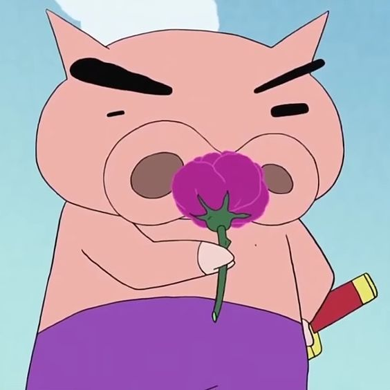
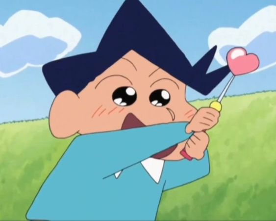

| 

## 👧 Project. 삐삐 (BIBI .Best interior)
> ### Main Project.
> **인테리어 추천 커뮤니티**
>  

>> **개발기간 : 2023.8.24 ~ 2023.9.22**
>> - **[Figma Link](https://www.figma.com/file/CXxCx5lHgWOuTcSXRfNpFj/%ED%94%84%EB%A1%9C%EC%A0%9D%ED%8A%B8-%EC%82%90%EC%82%90?type=design&node-id=0%3A1&mode=design&t=ob5cQX8qN4N8r8Os-1)**
>> - **[배포사이트]()**

 

## 🧑‍💻 프로젝트팀 소개
|
윤 예빈
|
최 유리
|
이 원호
|
신 선호
|
박 두산
|
임 한준
|
안 형섭
|
|---|---|---|---|---|---|---|
||||||||
|
`FE_팀장`
|
`FE_팀원`
|
`FE_팀원`
|
`BE_부팀장`
|
`BE_팀원`
|
`BE_팀원`
|
`BE_팀원`
|
|[@YebinYun](https://github.com/YebinYun)|[@greatjobcat](https://github.com/greatjobcat)|[@WONHO22](https://github.com/WONHO22)|[@seonhoshin](https://github.com/seonhoshin)|[@2DNDN](https://github.com/2DNDN)|[@Ernest45](https://github.com/Ernest45)|[@PeterAhnn](https://github.com/PeterAhnn)|

 

## ✨ Git Commit Type

### "[Type] #이슈 번호 - 커밋 메시지" 
**(ex. [Feat] #10 - 메인 화면 구현)**

|Type||
|---|---|
|Feat|새로운 기능을 추가할 경우|
|Fix|버그를 고친 경우|
|Docs|문서를 수정한 경우|
|Style|코드 포맷 변경, 세미 콜론 누락, 코드 수정이 없는 경우|
|Refactor|프로덕션 코드 리팩토링|
|Test|테스트 추가, 테스트 리팩토링 (코드 변경 X)|
|Chore|빌드 태스트 업데이트, 패키지 매니저를 설정하는 경우 (코드 변경 X)|
|Design|CSS 등 사용자 UI 디자인 변경|
|Comment|필요한 주석 추가 및 변경|
|Rename|파일 혹은 폴더명을 수정하는 경우|
|remove|사용하지 않는 파일 혹은 폴더를 삭제하는 경우|
|Init|초기세팅하는 경우|

 

## ☕ Team Culture

### 회의 시간
- **오전 회의 (오전 10시)** : 구현할 내용/ 업무 분담/ 역할 분배, 각 파트(FE/BE)에서 피드백 시간 (이슈 공유)
- **오후 회의 (오후 5시)** : 그날 진행 정도 확인 및 평가(브리핑) / merge 종합하는 시간

### 개발 관련 규칙
- 쿠션어 사용
- 호칭 : (○○님)
- 질문은 명확하게, 피드백은 존중을 담아서
- 반응 잘하기
- 불만상항이나 불편사항 발생시,  팀장 / 부팀장 면담 언제든 가능🫶
- 죄송합니다 (x) → 감사합니다 (o)
  - 사용시 : 1회당 1시간 회의 진행하기